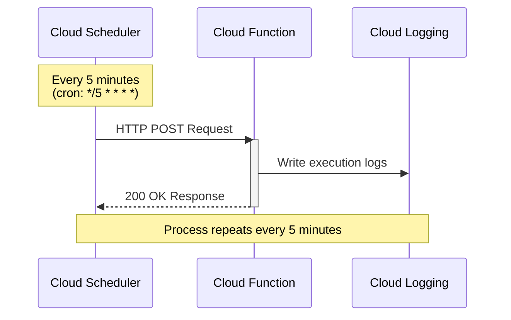

# Cloud Scheduler Demo

This demo shows how to use Cloud Scheduler to run periodic tasks on a schedule.

## What This Demo Does

Creates a scheduled job that:
1. Triggers a Cloud Function every 5 minutes
2. The function logs a message and returns a timestamp
3. Demonstrates both HTTP and Pub/Sub targets

## Architecture



**Flow:**
1. Cloud Scheduler triggers based on cron schedule (`*/5 * * * *`)
2. Sends HTTP POST request to Cloud Function endpoint
3. Cloud Function executes and logs output
4. Returns HTTP 200 response to Scheduler
5. Scheduler waits until next scheduled time

## Files

- `setup.sh`: Sets up the Cloud Function and Scheduler job
- `trigger.sh`: Manually triggers the job (for testing)
- `cleanup.sh`: Removes all created resources
- `function/`: Contains the Cloud Function code

## Prerequisites

- GCP project with billing enabled
- Cloud Scheduler API enabled
- Cloud Functions API enabled
- `gcloud` CLI authenticated

## Running the Demo

### 1. Setup

```bash
chmod +x setup.sh trigger.sh cleanup.sh
./setup.sh
```

This will:
- Create a Cloud Function that logs messages
- Create a Cloud Scheduler job that runs every 5 minutes
- Set up proper IAM permissions

### 2. Test the Scheduler (Optional)

Instead of waiting 5 minutes, manually trigger the job:

```bash
./trigger.sh
```

### 3. View Logs

Check the Cloud Function logs to see executions:

```bash
gcloud functions logs read scheduler-demo-function --region=us-central1 --limit=10
```

Or view in Cloud Console:
```
https://console.cloud.google.com/functions/details/us-central1/scheduler-demo-function
```

### 4. View Scheduler Job

Check the job status:

```bash
gcloud scheduler jobs describe scheduler-demo-job --location=us-central1
```

View execution history in Cloud Console:
```
https://console.cloud.google.com/cloudscheduler
```

### 5. Cleanup

Remove all created resources:

```bash
./cleanup.sh
```

## Key Concepts Demonstrated

1. **Cron Syntax**: Uses `*/5 * * * *` to run every 5 minutes
2. **HTTP Target**: Scheduler invokes Cloud Function via HTTP POST
3. **Authentication**: Uses OIDC authentication for security
4. **Retry Logic**: Configures retry attempts and backoff

## Cron Schedule Examples

- `*/5 * * * *` - Every 5 minutes
- `0 */6 * * *` - Every 6 hours
- `0 9 * * 1` - Every Monday at 9 AM
- `0 2 * * *` - Every day at 2 AM
- `0 0 1 * *` - First day of every month at midnight

## Cost

- Cloud Scheduler: First 3 jobs free, then $0.10/job/month
- Cloud Functions: Free tier includes 2M invocations/month
- This demo will cost virtually nothing for testing

## Troubleshooting

**Job not running?**
- Check that Cloud Scheduler API is enabled
- Verify IAM permissions are correct
- Check function logs for errors

**Function failing?**
- View logs: `gcloud functions logs read scheduler-demo-function --region=us-central1`
- Ensure function deployed successfully: `gcloud functions describe scheduler-demo-function --region=us-central1`

**Permission errors?**
- The setup script creates a service account and grants necessary permissions
- Verify: `gcloud iam service-accounts list`
