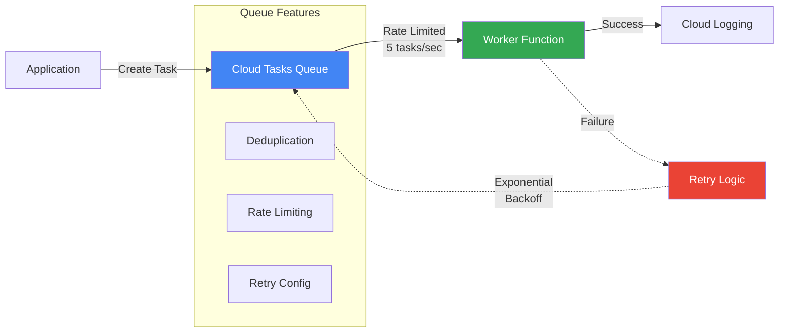
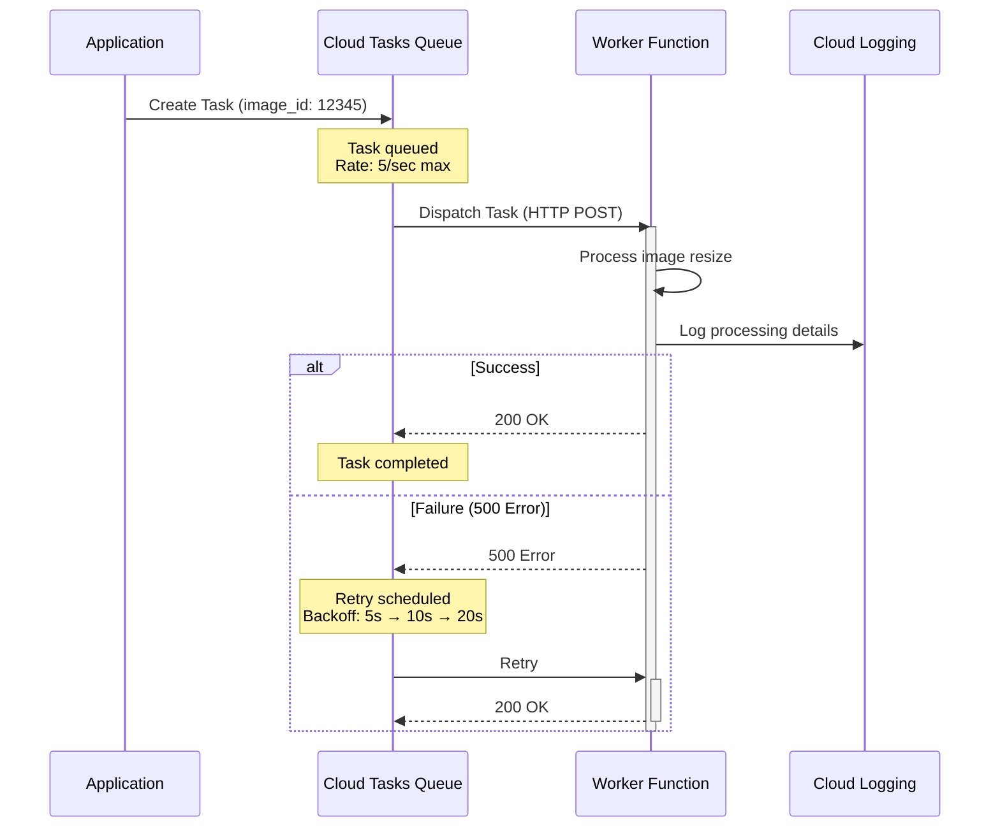

# Cloud Tasks Demo

This demo shows how to use Cloud Tasks for asynchronous task processing with rate limiting and retries.

## What This Demo Does

Creates a task queue system that:
1. Creates a Cloud Tasks queue with rate limiting
2. Deploys a Cloud Function as a worker to process tasks
3. Demonstrates enqueueing tasks programmatically
4. Shows retry behavior and rate limiting in action

## Architecture



**Detailed Flow:**



**Key Features:**
1. **Rate Limiting**: Max 5 tasks/second to prevent overwhelming workers
2. **Automatic Retries**: Failed tasks retry with exponential backoff
3. **Deduplication**: Same task name prevents duplicate execution
4. **Ordered Delivery**: FIFO available if needed

## Use Case Simulated

Image processing pipeline where:
- User uploads trigger task creation
- Tasks are rate-limited to avoid overwhelming the processing service
- Failed tasks are automatically retried with backoff
- Tasks are processed asynchronously without blocking user requests

## Files

- `setup.sh`: Creates the Cloud Function worker and task queue
- `trigger.sh`: Creates sample tasks and adds them to the queue
- `cleanup.sh`: Removes all created resources
- `worker/`: Contains the Cloud Function worker code
- `create-tasks.sh`: Script to create multiple tasks for testing

## Prerequisites

- GCP project with billing enabled
- Cloud Tasks API enabled
- Cloud Functions API enabled
- `gcloud` CLI authenticated

## Running the Demo

### 1. Setup

```bash
chmod +x setup.sh trigger.sh cleanup.sh create-tasks.sh
./setup.sh
```

This will:
- Create a Cloud Function worker that processes tasks
- Create a Cloud Tasks queue with rate limiting (5 tasks/second max)
- Configure retry settings with exponential backoff

### 2. Create Tasks

Add tasks to the queue:

```bash
./trigger.sh
```

Or create multiple tasks for load testing:

```bash
./create-tasks.sh 20  # Creates 20 tasks
```

### 3. Monitor Task Processing

Watch the worker function logs:

```bash
gcloud functions logs read tasks-demo-worker --region=us-central1 --limit=20
```

View queue statistics:

```bash
gcloud tasks queues describe tasks-demo-queue --location=us-central1
```

List tasks in the queue:

```bash
gcloud tasks list --queue=tasks-demo-queue --location=us-central1
```

### 4. Test Rate Limiting

Create many tasks quickly to see rate limiting in action:

```bash
./create-tasks.sh 50
```

The queue will throttle delivery to respect the configured rate limit.

### 5. Cleanup

Remove all created resources:

```bash
./cleanup.sh
```

## Key Concepts Demonstrated

1. **Task Queue Configuration**: Rate limits, retry settings, backoff
2. **Task Creation**: Programmatic task enqueueing with custom payloads
3. **HTTP Target**: Tasks delivered to Cloud Function via HTTP POST
4. **Rate Limiting**: Prevents overwhelming downstream services
5. **Retry Logic**: Automatic retries with exponential backoff
6. **Task Deduplication**: Same task name prevents duplicate execution

## Queue Configuration

```bash
Max dispatches per second: 5
Max concurrent dispatches: 10
Max retry attempts: 5
Min backoff: 5s
Max backoff: 3600s (1 hour)
```

## Task Payload Example

```json
{
  "image_id": "img-12345",
  "operation": "resize",
  "dimensions": {
    "width": 800,
    "height": 600
  },
  "format": "jpg"
}
```

## Cost

- Cloud Tasks: First 1M operations free, then $0.40 per million
- Cloud Functions: Free tier includes 2M invocations/month
- This demo will cost virtually nothing for testing

## Common Use Cases

- **Image/Video Processing**: Process uploads asynchronously
- **Email Sending**: Queue emails without blocking API requests
- **API Rate Limiting**: Call third-party APIs with controlled rates
- **Batch Processing**: Process large datasets in chunks
- **Fan-out**: Distribute work to multiple workers

## Troubleshooting

**Tasks not being processed?**
- Check worker function is deployed: `gcloud functions describe tasks-demo-worker --gen2 --region=us-central1`
- View worker logs for errors: `gcloud functions logs read tasks-demo-worker --region=us-central1`
- Verify queue exists: `gcloud tasks queues describe tasks-demo-queue --location=us-central1`

**Tasks failing repeatedly?**
- Check retry configuration
- View task details: `gcloud tasks describe TASK_NAME --queue=tasks-demo-queue --location=us-central1`
- Increase max retry attempts if needed

**Rate limiting not working?**
- Verify queue configuration: `gcloud tasks queues describe tasks-demo-queue --location=us-central1`
- Create more tasks to exceed the rate limit threshold
