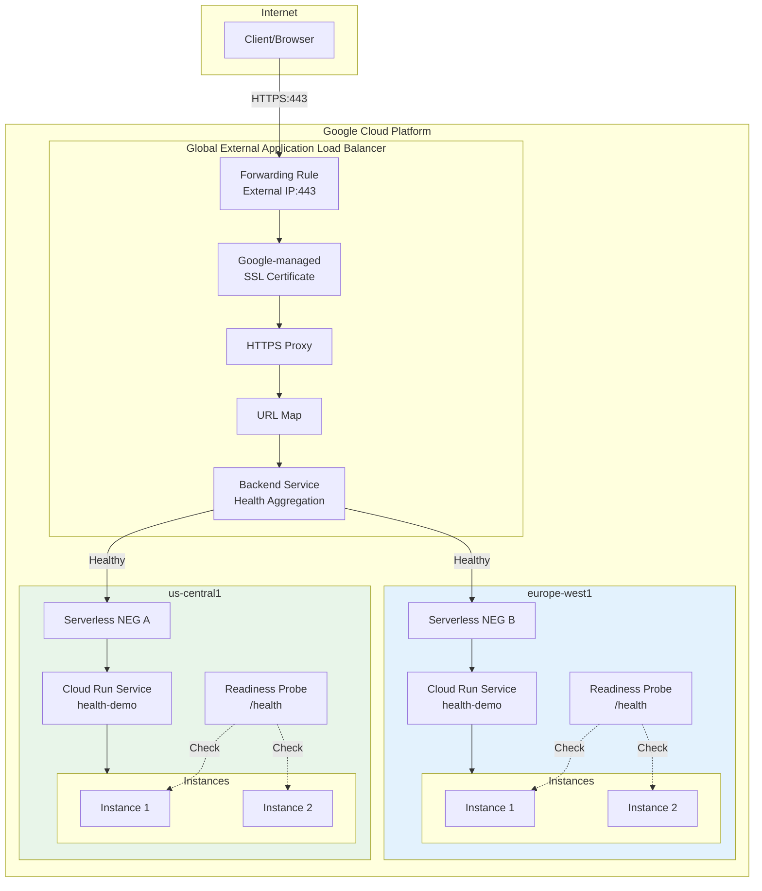
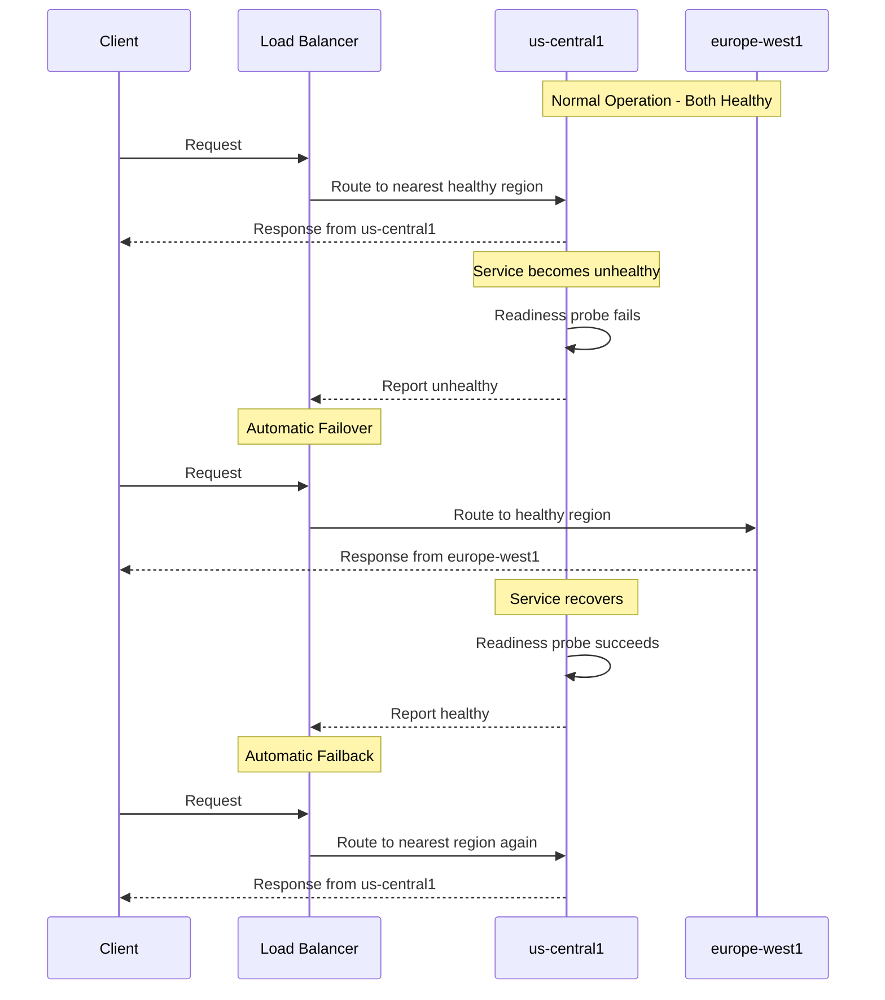

# Cloud Run Service Health Demo - Architecture Plan

## Overview

This demo demonstrates **Cloud Run service health** for automated multi-region failover using:
- **Readiness probes** to report service health
- **Global External Application Load Balancer** for traffic distribution
- **HTTPS with Google-managed SSL certificate** for secure traffic
- **Serverless NEGs** to connect Cloud Run to the load balancer
- **Automated failover/failback** based on health status

## Architecture



## Failover Scenario



## Project Structure

```
cloudrun-health/
├── README.md                 # Comprehensive documentation
├── PLAN.md                   # This architecture plan
├── 01-setup.sh              # Deploy services + load balancer
├── 02-test-failover.sh      # Test failover scenarios
├── 99-cleanup.sh            # Remove all resources
└── app/
    ├── Dockerfile           # Container definition
    ├── main.py              # Flask app with health endpoint
    └── requirements.txt     # Python dependencies
```

## Python Application Design

The demo application will have these endpoints:

| Endpoint | Method | Description |
|----------|--------|-------------|
| `/` | GET | Main page showing service info and region |
| `/health` | GET | Readiness probe endpoint (returns 200 or 503) |
| `/set_health?healthy=true/false` | POST | Control health status |
| `/set_readiness?percent=N` | POST | Set percentage of healthy responses |
| `/status` | GET | Show current health configuration |

### Health Control Mechanisms

1. **Binary Health**: Set service as fully healthy or unhealthy
2. **Percentage-Based**: Simulate gradual degradation (e.g., 50% of probes fail)

## SSL Certificate Options

The demo supports two approaches for HTTPS:

### Option 1: Google-managed Certificate (Recommended for Production)
Requires a domain you own. Google automatically provisions and renews the certificate.

### Option 2: Self-signed Certificate (For Quick Testing)
No domain required. Uses a self-signed certificate for testing purposes.

## Deployment Steps (01-setup.sh)

```bash
# 1. Set variables
PROJECT_ID=$(gcloud config get-value project)
SERVICE=health-demo
REGION_A=us-central1
REGION_B=europe-west1
DOMAIN=""  # Optional: Set your domain for Google-managed cert

# 2. Build container image
gcloud builds submit --tag gcr.io/$PROJECT_ID/health-demo app

# 3. Deploy to Region A with readiness probe
gcloud run deploy $SERVICE \
    --region=$REGION_A \
    --image=gcr.io/$PROJECT_ID/health-demo \
    --allow-unauthenticated \
    --min-instances=1

# 4. Add readiness probe via YAML
# (Update service with readiness probe configuration)

# 5. Deploy to Region B
gcloud run deploy $SERVICE \
    --region=$REGION_B \
    --image=gcr.io/$PROJECT_ID/health-demo \
    --allow-unauthenticated \
    --min-instances=1

# 6. Create Backend Service
gcloud compute backend-services create $SERVICE-bs \
    --load-balancing-scheme=EXTERNAL_MANAGED \
    --global

# 7. Create Serverless NEGs
gcloud compute network-endpoint-groups create $SERVICE-neg-$REGION_A \
    --region=$REGION_A \
    --network-endpoint-type=serverless \
    --cloud-run-service=$SERVICE

gcloud compute network-endpoint-groups create $SERVICE-neg-$REGION_B \
    --region=$REGION_B \
    --network-endpoint-type=serverless \
    --cloud-run-service=$SERVICE

# 8. Add backends
gcloud compute backend-services add-backend $SERVICE-bs \
    --global \
    --network-endpoint-group=$SERVICE-neg-$REGION_A \
    --network-endpoint-group-region=$REGION_A

gcloud compute backend-services add-backend $SERVICE-bs \
    --global \
    --network-endpoint-group=$SERVICE-neg-$REGION_B \
    --network-endpoint-group-region=$REGION_B

# 9. Reserve external IP address
gcloud compute addresses create $SERVICE-ip \
    --network-tier=PREMIUM \
    --ip-version=IPV4 \
    --global

# 10. Create SSL Certificate
if [ -n "$DOMAIN" ]; then
    # Option 1: Google-managed certificate (requires domain)
    gcloud compute ssl-certificates create $SERVICE-cert \
        --domains=$DOMAIN \
        --global
else
    # Option 2: Self-signed certificate (for testing)
    openssl req -x509 -nodes -days 365 -newkey rsa:2048 \
        -keyout /tmp/key.pem \
        -out /tmp/cert.pem \
        -subj "/CN=health-demo/O=Demo"
    
    gcloud compute ssl-certificates create $SERVICE-cert \
        --certificate=/tmp/cert.pem \
        --private-key=/tmp/key.pem \
        --global
fi

# 11. Create URL map
gcloud compute url-maps create $SERVICE-lb \
    --default-service=$SERVICE-bs

# 12. Create HTTPS target proxy (with SSL certificate)
gcloud compute target-https-proxies create $SERVICE-https-proxy \
    --url-map=$SERVICE-lb \
    --ssl-certificates=$SERVICE-cert \
    --global

# 13. Create HTTPS forwarding rule (port 443)
gcloud compute forwarding-rules create $SERVICE-https-fr \
    --load-balancing-scheme=EXTERNAL_MANAGED \
    --network-tier=PREMIUM \
    --address=$SERVICE-ip \
    --target-https-proxy=$SERVICE-https-proxy \
    --global \
    --ports=443

# 14. (Optional) Create HTTP to HTTPS redirect
gcloud compute url-maps import $SERVICE-http-redirect --source=- --global <<EOF
name: $SERVICE-http-redirect
defaultUrlRedirect:
  redirectResponseCode: MOVED_PERMANENTLY_DEFAULT
  httpsRedirect: True
EOF

gcloud compute target-http-proxies create $SERVICE-http-proxy \
    --url-map=$SERVICE-http-redirect \
    --global

gcloud compute forwarding-rules create $SERVICE-http-fr \
    --load-balancing-scheme=EXTERNAL_MANAGED \
    --network-tier=PREMIUM \
    --address=$SERVICE-ip \
    --target-http-proxy=$SERVICE-http-proxy \
    --global \
    --ports=80
```

## Testing Script (02-test-failover.sh)

The test script will:

1. **Get Load Balancer IP** and show initial state
2. **Make requests** through the LB showing which region responds
3. **Set Region A unhealthy** via the `/set_health` endpoint
4. **Observe failover** - requests now go to Region B
5. **Restore Region A health** 
6. **Observe failback** - requests return to Region A

## Readiness Probe Configuration

```yaml
apiVersion: serving.knative.dev/v1
kind: Service
metadata:
  name: health-demo
spec:
  template:
    spec:
      containers:
        - image: gcr.io/PROJECT_ID/health-demo
          ports:
            - containerPort: 8080
          readinessProbe:
            httpGet:
              path: /health
              port: 8080
            periodSeconds: 10
            failureThreshold: 3
            successThreshold: 1
            timeoutSeconds: 1
```

## Key Concepts to Document

### 1. Readiness Probes vs Startup Probes

| Probe Type | Purpose | When Used |
|------------|---------|-----------|
| **Startup Probe** | Check if container started successfully | At container start |
| **Readiness Probe** | Check if container can serve traffic | Continuously |
| **Liveness Probe** | Check if container needs restart | Not supported in Cloud Run |

### 2. Health Aggregation

- Cloud Run aggregates health from all instances in a region
- If enough instances are unhealthy, the region is marked unhealthy
- The load balancer then shifts traffic to healthy regions

### 3. Limitations

- Requires at least 1 min-instance to always have health status
- Only HTTP probes supported (no TCP/gRPC)
- Cross-region internal application load balancer not supported
- URL masks and tags not supported in Serverless NEG

## Cost Considerations

| Resource | Cost |
|----------|------|
| Cloud Run | Pay per request/CPU time |
| Global Load Balancer | ~$0.025/hour + data processing |
| External IP | ~$0.01/hour when attached |
| SSL Certificate | Free (Google-managed) |
| **Minimum instances** | Billed even without traffic |

**Note:** Using `min-instances=1` in each region ensures health can always be calculated but incurs continuous costs.

## Files to Create

1. **`app/main.py`** - Flask application with health control
2. **`app/Dockerfile`** - Container image definition  
3. **`app/requirements.txt`** - Python dependencies
4. **`01-setup.sh`** - Full deployment script
5. **`02-test-failover.sh`** - Interactive test script
6. **`99-cleanup.sh`** - Resource cleanup
7. **`README.md`** - Comprehensive documentation

## Next Steps

After user approval:
1. Create the folder structure
2. Implement the Python application
3. Create deployment scripts
4. Write comprehensive README documentation
5. Test the demo