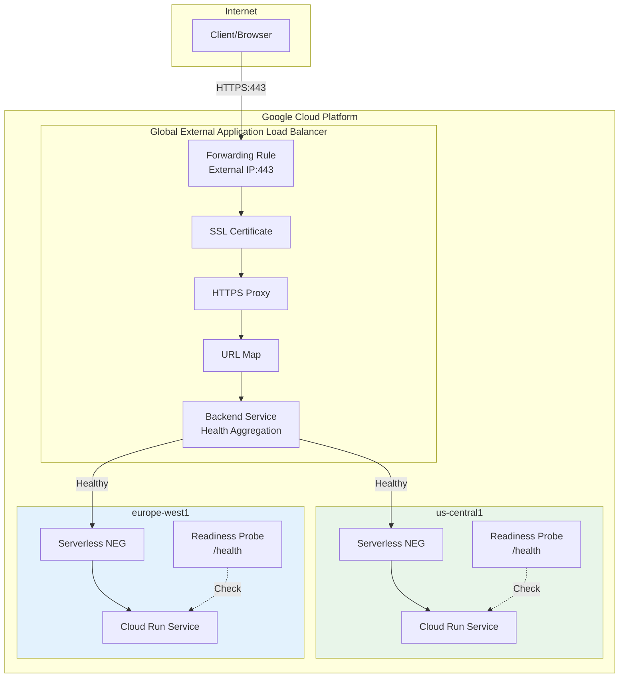
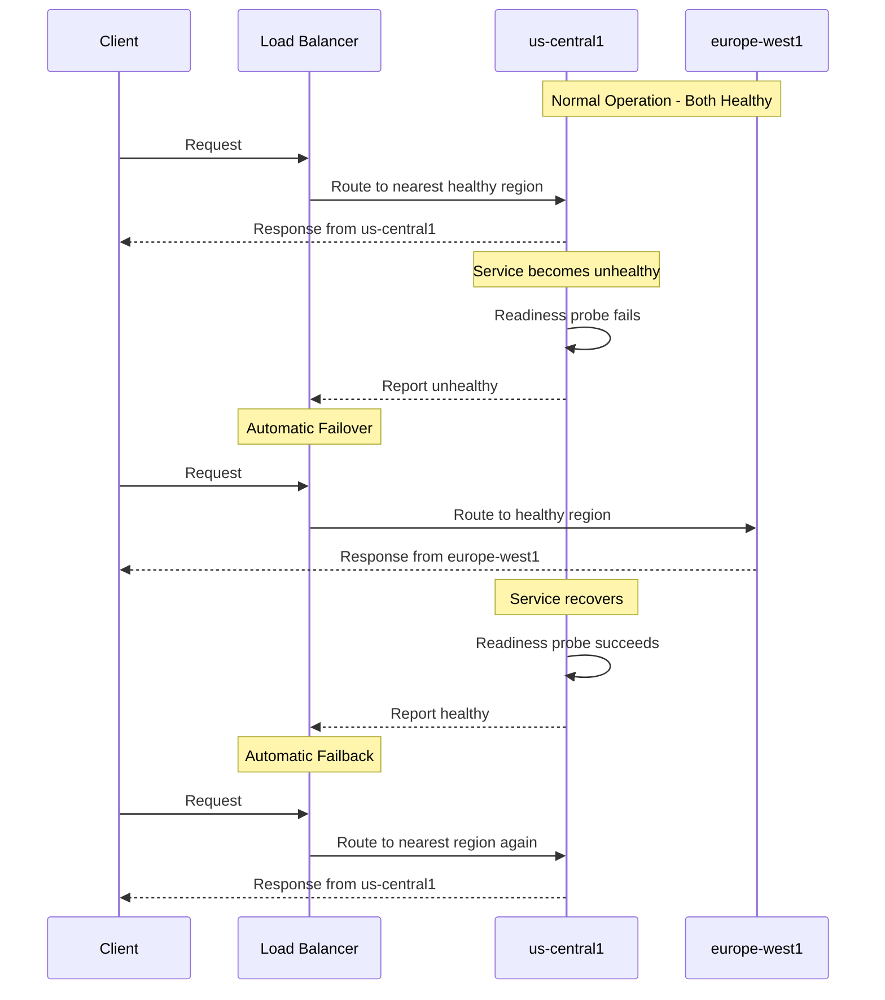

# Cloud Run Service Health Demo

This demo demonstrates **Cloud Run service health** for automated multi-region failover with **readiness probes**, **Global External Application Load Balancer**, and **HTTPS with SSL certificates**.

## Overview

Cloud Run service health enables automatic failover between regions when a service becomes unhealthy. This is achieved through:

1. **Readiness Probes**: Cloud Run monitors instance health via HTTP readiness probes
2. **Health Aggregation**: Service health is aggregated across all instances in a region
3. **Global Load Balancer**: Routes traffic to healthy regions automatically
4. **Serverless NEGs**: Connect Cloud Run services to the load balancer

When a region's health degrades, the load balancer automatically shifts traffic to healthy regions. When health is restored, traffic fails back based on proximity.

## Architecture



## Failover Scenario



## Prerequisites

- Google Cloud SDK (`gcloud`) installed and configured
- A GCP project with billing enabled
- Permissions to:
  - Deploy Cloud Run services
  - Create load balancer resources
  - Create SSL certificates
  - Enable APIs

## Required APIs

| API | Purpose |
|-----|---------|
| `run.googleapis.com` | Deploy Cloud Run services |
| `compute.googleapis.com` | Load balancer, NEGs, SSL |
| `cloudbuild.googleapis.com` | Build container images |
| `artifactregistry.googleapis.com` | Store container images |

## Quick Start

### 1. Set Your Project

```bash
gcloud config set project YOUR_PROJECT_ID
```

### 2. Deploy the Demo

```bash
cd cloudrun-health
chmod +x *.sh

# Option A: Self-signed certificate (for testing)
./01-setup.sh

# Option B: Google-managed certificate (requires a domain)
./01-setup.sh your-domain.com
```

### 3. Browser Testing

To test the web UI in your browser (handles authentication automatically):

```bash
./02-browser-test.sh
```

### 4. Test Failover (CLI)

```bash
./03-test-failover.sh
```

This creates local proxies:
- http://localhost:8080 → us-central1 service
- http://localhost:8081 → europe-west1 service

Open these URLs in your browser to access the full web interface.

### 5. Clean Up

```bash
./99-cleanup.sh
```

## Project Structure

```
cloudrun-health/
├── README.md                 # This documentation
├── PLAN.md                   # Architecture plan
├── 01-setup.sh              # Deploy services + load balancer
├── 02-browser-test.sh       # Browser testing with local proxy
├── 03-test-failover.sh      # Test failover scenarios (CLI)
├── 99-cleanup.sh            # Remove all resources
├── .gitignore               # Ignore generated files
└── app/
    ├── Dockerfile           # Container definition
    ├── main.py              # Flask app with health endpoints
    └── requirements.txt     # Python dependencies
```

## The Demo Application

The Python Flask application provides these endpoints:

| Endpoint | Method | Description |
|----------|--------|-------------|
| `/` | GET | Web UI showing service info and health controls |
| `/health` | GET | Readiness probe endpoint (200 or 503) |
| `/set_health` | POST | Set health status (`?healthy=true` or `false`) |
| `/set_readiness` | POST | Set readiness percent (`?percent=0-100`) |
| `/status` | GET | JSON status of current configuration |

### Web Interface

The main page (`/`) provides a visual interface to:
- View current region, health status, and instance ID
- Toggle health on/off with buttons
- Set a readiness percentage (for partial failures)
- See API examples for scripted testing

## Readiness Probe Configuration

The readiness probe is configured in the Cloud Run service YAML:

```yaml
spec:
  template:
    spec:
      containers:
        - image: gcr.io/PROJECT_ID/health-demo
          readinessProbe:
            httpGet:
              path: /health
              port: 8080
            periodSeconds: 10      # Check every 10 seconds
            failureThreshold: 3    # Mark unhealthy after 3 failures
            successThreshold: 1    # Mark healthy after 1 success
            timeoutSeconds: 1      # Timeout for each check
```

### Probe Parameters

| Parameter | Description | Default |
|-----------|-------------|---------|
| `path` | HTTP path to check | `/` |
| `port` | Container port | Container port |
| `periodSeconds` | How often to check | 10 |
| `failureThreshold` | Failures before unhealthy | 3 |
| `successThreshold` | Successes before healthy | 1 |
| `timeoutSeconds` | Timeout per check | 1 |

## SSL Certificate Options

### Option 1: Self-Signed Certificate (Default)

For quick testing without a domain:

```bash
./01-setup.sh
```

- No domain required
- Browser will show security warning (expected)
- Use `-k` flag with curl to skip verification

### Option 2: Google-Managed Certificate

For production with a domain you own:

```bash
./01-setup.sh your-domain.com
```

- Requires DNS configuration
- Automatically provisioned and renewed by Google
- Full browser trust

After running, update your DNS:
```
A record: your-domain.com → LOAD_BALANCER_IP
```

## Authentication

**Important:** If your GCP project has an organization policy that prevents unauthenticated access (Domain Restricted Sharing), you'll need to authenticate all requests.

### Getting an Auth Token

```bash
# Get an identity token for authenticated requests
export TOKEN=$(gcloud auth print-identity-token)
```

### Making Authenticated Requests

```bash
# Include the token in all requests
curl -H "Authorization: Bearer $TOKEN" https://YOUR_SERVICE_URL/status
```

## Browser Testing

The easiest way to test the full web experience is with the browser test script:

```bash
./02-browser-test.sh
```

This uses `gcloud run services proxy` to create authenticated local proxies:

| Local URL | Cloud Run Service |
|-----------|-------------------|
| http://localhost:8080 | us-central1 |
| http://localhost:8081 | europe-west1 |

**Features:**
- No authentication headers needed in browser
- Full access to the web UI
- Toggle health status with buttons
- See real-time status updates

**To test failover:**
1. Open http://localhost:8080 in your browser
2. Click "Set Unhealthy" button
3. Open http://localhost:8081 to verify the other region is still healthy
4. Toggle health back and forth to see the effects

Press `Ctrl+C` to stop the proxies when done.

## Manual Testing (CLI)

### Through the Load Balancer

```bash
# Get the load balancer IP
LB_IP=$(gcloud compute addresses describe health-demo-ip --global --format='value(address)')

# Check status (use -k for self-signed cert)
# Note: Load balancer may require IAP or authentication depending on backend config
curl -sk https://$LB_IP/status | jq .

# View the web interface
open https://$LB_IP
```

### Direct to Regions (with Authentication)

```bash
# Get auth token
export TOKEN=$(gcloud auth print-identity-token)

# Get service URLs
URL_A=$(gcloud run services describe health-demo --region=us-central1 --format='value(status.url)')
URL_B=$(gcloud run services describe health-demo --region=europe-west1 --format='value(status.url)')

# Check health directly (authenticated)
curl -H "Authorization: Bearer $TOKEN" $URL_A/health
curl -H "Authorization: Bearer $TOKEN" $URL_B/health

# Make Region A unhealthy
curl -X POST -H "Authorization: Bearer $TOKEN" "$URL_A/set_health?healthy=false"

# Restore health
curl -X POST -H "Authorization: Bearer $TOKEN" "$URL_A/set_health?healthy=true"

# Set 50% readiness (random failures)
curl -X POST -H "Authorization: Bearer $TOKEN" "$URL_A/set_readiness?percent=50"
```

## How It Works

### 1. Health Aggregation

Cloud Run aggregates health from all instances in a region:
- Each instance responds to readiness probe checks
- If too many instances are unhealthy, the region is marked unhealthy
- The Serverless NEG reports this to the backend service

### 2. Traffic Routing

The Global Load Balancer routes traffic based on:
- **Health**: Only routes to healthy backends
- **Proximity**: Prefers geographically closer regions
- **Capacity**: Balances load across healthy backends

### 3. Failover Timing

| Event | Typical Time |
|-------|--------------|
| Probe failure detection | 10-30 seconds |
| Load balancer failover | 30-60 seconds |
| Probe recovery detection | 10 seconds |
| Load balancer failback | 30-60 seconds |

## Important Considerations

### Minimum Instances

You **must** set `minScale: 1` (or higher) to ensure health can always be calculated:

```yaml
metadata:
  annotations:
    autoscaling.knative.dev/minScale: "1"
```

Without min instances, Cloud Run may scale to zero, preventing health checks.

### Limitations

| Limitation | Description |
|------------|-------------|
| HTTP probes only | TCP and gRPC probes not supported |
| Min instances required | Need at least 1 instance per region |
| Cross-region internal ALB | Not supported with service health |
| URL masks/tags in NEG | Not supported |

## Cost Considerations

| Resource | Cost |
|----------|------|
| Cloud Run | Pay per request + CPU/memory time |
| Minimum instances | Billed even without traffic |
| Global Load Balancer | ~$0.025/hour + data processing |
| External IP | ~$0.01/hour when attached |
| SSL Certificate | Free (Google-managed) |

**Estimated monthly cost** (with min instances):
- ~$20-30 for load balancer
- ~$15-25 per region for min instances
- Variable based on traffic

## Troubleshooting

### Load Balancer Returns 502/503

1. Check if services are deployed and running:
   ```bash
   gcloud run services list
   ```

2. Verify services are healthy:
   ```bash
   curl $(gcloud run services describe health-demo --region=us-central1 --format='value(status.url)')/health
   ```

3. Wait for load balancer to be fully provisioned (5-10 minutes after creation)

### Health Check Failures

1. Check readiness probe configuration:
   ```bash
   gcloud run services describe health-demo --region=us-central1 --format=yaml
   ```

2. Verify the `/health` endpoint returns 200:
   ```bash
   curl -I $SERVICE_URL/health
   ```

### SSL Certificate Issues

1. For Google-managed certs, verify DNS is configured correctly
2. Certificate provisioning can take 15-30 minutes
3. Check certificate status:
   ```bash
   gcloud compute ssl-certificates describe health-demo-cert --global
   ```

### Traffic Not Failing Over

1. Verify the service is actually unhealthy:
   ```bash
   curl $SERVICE_URL/status
   ```

2. Wait for probe failure threshold (30 seconds with default settings)
3. Check backend service health:
   ```bash
   gcloud compute backend-services get-health health-demo-bs --global
   ```

## References

### Official Documentation

- [Cloud Run service health (Preview)](https://cloud.google.com/run/docs/multiple-regions#service-health)
- [Configuring health checks](https://cloud.google.com/run/docs/configuring/healthchecks)
- [Readiness probes](https://cloud.google.com/run/docs/configuring/healthchecks#readiness-probes)
- [Multi-region deployment](https://cloud.google.com/run/docs/multiple-regions)

### Related Resources

- [Global External Application Load Balancer](https://cloud.google.com/load-balancing/docs/https)
- [Serverless NEGs](https://cloud.google.com/load-balancing/docs/negs/serverless-neg-concepts)
- [Google-managed SSL certificates](https://cloud.google.com/load-balancing/docs/ssl-certificates/google-managed-certs)

## License

This demo is provided as-is for educational purposes. See the main repository LICENSE file for details.