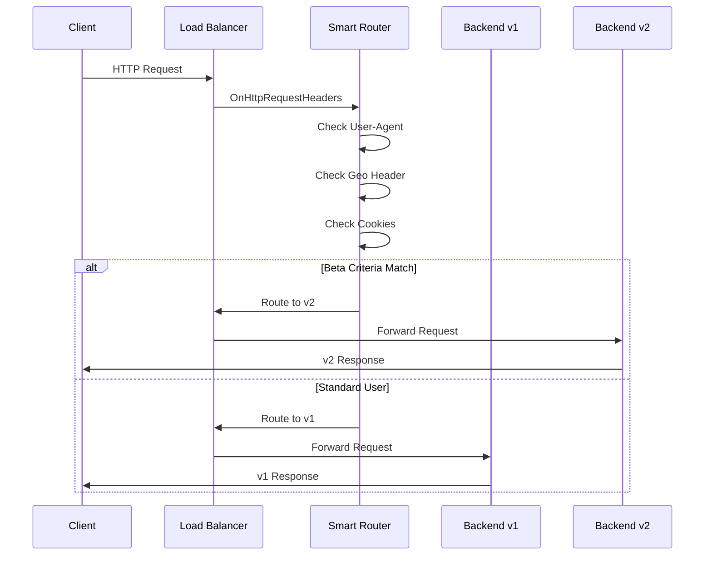

# Demo 2: Smart Router - A/B Testing & Canary Deployments

A proxy-wasm plugin that inspects HTTP request headers and cookies to make intelligent routing decisions for A/B testing and canary deployments.

## Quick Start

```bash
# Complete workflow: build, test, deploy, and verify (default)
make all

# Quick build and test only (no deployment)
make quick

# Or step by step:
make build      # Build the Wasm plugin and container
make test       # Run tests
make deploy     # Deploy to Cloud Run
make test-live  # Verify routing works
```

## Available Make Targets

| Target | Description |
|--------|-------------|
| `make all` | Build, test, and deploy (default) |
| `make full` | Complete workflow: build, test, deploy, test-live |
| `make build` | Build Wasm plugin (TinyGo) and container (Cloud Build) |
| `make build-wasm` | Build only the Wasm plugin |
| `make build-container` | Build only the container image |
| `make test` | Run Go unit tests |
| `make test-cover` | Run tests with coverage |
| `make deploy` | Deploy to Cloud Run |
| `make test-live` | Test deployed service with authentication |
| `make destroy` | Clean up all GCP resources |
| `make docker-up` | Start local Docker Compose environment |
| `make docker-down` | Stop local Docker Compose environment |
| `make lint` | Run golangci-lint |
| `make fmt` | Format code |
| `make clean` | Clean build artifacts |

## What It Does

This plugin intercepts HTTP requests at the Load Balancer level and:

1. **Inspects** request headers, cookies, and query parameters
2. **Evaluates** routing rules in priority order
3. **Routes** traffic to different backend versions
4. **Adds** attribution headers for debugging



## Routing Criteria

### Default Beta Tester Rules

All conditions must match:

| Condition | Header/Cookie | Value |
|-----------|---------------|-------|
| Device | `User-Agent` | Contains "iPhone" |
| Location | `X-Geo-Country` | Equals "DE" |
| Beta Flag | `Cookie: beta-tester` | Equals "true" |

### Canary Deployment

| Condition | Header | Value |
|-----------|--------|-------|
| Hash-based | `X-Request-Hash` | Single digit (0-9) = 10% traffic |

## Prerequisites

- Go 1.21+
- TinyGo 0.39+: [tinygo.org/getting-started](https://tinygo.org/getting-started/)
  - macOS: `brew tap tinygo-org/tools && brew install tinygo`
- GCP project with billing enabled (for deployment)

## Building

```bash
# Build with TinyGo
tinygo build -o smart_router.wasm -scheduler=none -target=wasm -panic=trap -no-debug ./main.go

# Or use make
make build
```

Output: `smart_router.wasm`

### ⚠️ GCP Service Extensions Sandbox Requirements

**CRITICAL**: GCP Service Extensions has strict WASM runtime restrictions. You **MUST** use these TinyGo flags:

```bash
# ✅ CORRECT for GCP Service Extensions
tinygo build -o smart_router.wasm -scheduler=none -target=wasm -panic=trap -no-debug ./main.go

# ❌ WRONG - Missing critical flags
tinygo build -o smart_router.wasm -target=wasi ./main.go
```

**Required Flags Explained:**

| Flag | Purpose | Without It |
|------|---------|------------|
| `-target=wasm` | Pure WebAssembly (NOT wasi) | ❌ `restricted_callback` error (WASI syscalls blocked) |
| `-scheduler=none` | Disable goroutine scheduler | ❌ proxy-wasm ABI incompatibility |
| `-panic=trap` | Trap on panic instead of Go runtime | ❌ `missing import: gojs.runtime.ticks` error |
| `-no-debug` | Reduce binary size | ⚠️ Larger binary, may hit size limits |

**Common Errors and Solutions:**

1. **`Function: _start failed: Uncaught Error: restricted_callback`**
   - **Cause**: Using `-target=wasi` which includes WASI syscalls
   - **Fix**: Use `-target=wasm` instead

2. **`Failed to load Wasm module due to a missing import: gojs.runtime.ticks`**
   - **Cause**: Go panic handler requires JavaScript runtime imports
   - **Fix**: Add `-panic=trap` to use WASM trap instruction instead

**GCP Service Extensions Sandbox Restrictions:**
- ❌ No WASI syscalls (file I/O, networking, etc.)
- ❌ No JavaScript imports (`gojs.*` functions)
- ❌ No OS-dependent Go standard library functions
- ✅ Only proxy-wasm SDK APIs and pure computation

**References:**
- [GCP Service Extensions Plugin Limitations](https://cloud.google.com/service-extensions/docs/plugins-overview#limitations)
- [Prepare Plugin Code (Go)](https://cloud.google.com/service-extensions/docs/prepare-plugin-code#go)
- [TinyGo Compiler Options](https://tinygo.org/docs/reference/usage/important-options/)

## Configuration

The plugin accepts JSON configuration through Envoy:

```json
{
  "log_level": "info",
  "default_target": "v1",
  "rules": [
    {
      "name": "beta-testers",
      "priority": 1,
      "conditions": [
        {"type": "header", "key": "User-Agent", "operator": "contains", "value": "iPhone"},
        {"type": "header", "key": "X-Geo-Country", "operator": "equals", "value": "DE"},
        {"type": "cookie", "key": "beta-tester", "operator": "equals", "value": "true"}
      ],
      "target": "v2",
      "add_headers": {
        "X-Routed-By": "smart-router",
        "X-Route-Reason": "beta-tester-match"
      }
    },
    {
      "name": "canary-10-percent",
      "priority": 2,
      "conditions": [
        {"type": "header", "key": "X-Request-Hash", "operator": "regex", "value": "^[0-9]$"}
      ],
      "target": "v2"
    }
  ]
}
```

### Configuration Options

| Option | Type | Default | Description |
|--------|------|---------|-------------|
| `log_level` | string | `"info"` | Log level: trace, debug, info, warn, error |
| `default_target` | string | `"v1"` | Default backend when no rules match |
| `rules` | array | `[]` | Routing rules in priority order |

### Routing Rule Schema

| Field | Type | Description |
|-------|------|-------------|
| `name` | string | Human-readable rule name |
| `priority` | int | Evaluation order (lower = first) |
| `conditions` | array | Conditions that must ALL match |
| `target` | string | Backend to route to |
| `add_headers` | object | Headers to add to request |
| `remove_headers` | array | Headers to remove from request |

### Condition Types

| Type | Key | Description |
|------|-----|-------------|
| `header` | Header name | Check request header |
| `cookie` | Cookie name | Check cookie value |
| `path` | (ignored) | Check request path |
| `query` | Param name | Check query parameter |

### Operators

| Operator | Description |
|----------|-------------|
| `equals` | Exact match |
| `contains` | Substring match |
| `prefix` | Starts with |
| `suffix` | Ends with |
| `regex` | Regular expression match |
| `exists` | Header/cookie exists |

## Request Headers Added

| Header | Description | Example |
|--------|-------------|---------|
| `x-route-target` | Backend target for Envoy routing | `v2` |
| `X-Routed-By` | Attribution header | `smart-router` |
| `X-Route-Reason` | Why this route was chosen | `beta-tester-match` |

## Response Headers Added

| Header | Description | Example |
|--------|-------------|---------|
| `X-Smart-Router` | Indicates router is active | `active` |

## Testing

### Unit Tests

```bash
# Run all tests
make test

# Run with coverage
make test-cover

# Run specific test
go test -v ./router -run TestDetermineRoute
```

### Testing Deployed Cloud Run Service

```bash
# Run all live tests with authentication
make test-live
```

**Expected output from `make test-live`:**

```
==========================================
1. CLOUD RUN DIRECT (no WASM filter)
==========================================
Service URL: https://demo2-smart-router-backend-xxxxx-uc.a.run.app

Health check:
{
  "demo": "02-smart-router",
  "status": "healthy"
}

Version endpoint:
{
  "version": "v1"
}

⏱️  Direct latency: 0.089s

==========================================
2. LOAD BALANCER (with WASM filter)
==========================================
Load Balancer IP: 34.102.xxx.xxx

Version endpoint (beta user -> v2):
{
  "version": "v2-beta"
}

Response headers (WASM indicator):
x-routed-by: smart-router
x-route-reason: beta-tester-match

⏱️  LB + WASM latency: 0.156s
```

### Manual Testing

```bash
# Direct to Cloud Run (no WASM)
curl -H "Authorization: Bearer $(gcloud auth print-identity-token)" \
  https://YOUR-SERVICE-URL.run.app/api/version

# Via Load Balancer (with WASM routing)
curl -k https://YOUR-LB-IP/api/version

# Beta user via Load Balancer
curl -k \
  -H "User-Agent: Mozilla/5.0 (iPhone; CPU iPhone OS 17_0)" \
  -H "X-Geo-Country: DE" \
  -H "Cookie: beta-tester=true" \
  https://YOUR-LB-IP/api/version
```

### Local Testing with Docker Compose

```bash
# Start the environment
make docker-up

# Test: Standard user -> routes to v1
curl http://localhost:10000/api/version
# Expected: {"version": "v1"}

# Test: Beta user -> routes to v2
curl -H "User-Agent: Mozilla/5.0 (iPhone; CPU iPhone OS 17_0)" \
     -H "X-Geo-Country: DE" \
     -H "Cookie: beta-tester=true" \
     http://localhost:10000/api/version
# Expected: {"version": "v2-beta"}

# Test: Partial match -> still v1
curl -H "User-Agent: Mozilla/5.0 (iPhone)" \
     -H "X-Geo-Country: US" \
     http://localhost:10000/api/version
# Expected: {"version": "v1"}

# Test: Canary with hash
curl -H "X-Request-Hash: 5" \
     http://localhost:10000/api/version
# Expected: {"version": "v2-beta"}

# Check routing headers
curl -v http://localhost:10000/api/version 2>&1 | grep -i "x-"
# X-Routed-By: smart-router
# X-Route-Reason: default

# Stop the environment
make docker-down
```

### Test Fixtures

See [DATA_STRUCTURES.md](../../DATA_STRUCTURES.md#demo-2-routing-test-cases) for comprehensive test cases.

## Project Structure

```
demos/02-smart-router/
├── go.mod              # Go module file
├── Makefile            # Build automation
├── README.md           # This file
├── main.go             # Main plugin implementation
├── router/
│   ├── types.go        # Type definitions
│   ├── router.go       # Routing logic
│   ├── router_test.go  # Router tests
│   ├── cookie.go       # Cookie parsing
│   └── cookie_test.go  # Cookie tests
└── smart_router.wasm   # Built Wasm file
```

## Architecture

### Plugin Lifecycle

1. **VM Context** (`vmContext`)
   - Creates plugin contexts for each Envoy worker

2. **Plugin Context** (`pluginContext`)
   - Loads configuration on startup
   - Creates router with rules
   - Creates HTTP contexts for requests

3. **HTTP Context** (`httpContext`)
   - Processes each request
   - Evaluates routing rules
   - Sets routing headers

### Rule Evaluation

1. Rules are sorted by priority (lower = first)
2. Each rule's conditions are evaluated with AND logic
3. First matching rule determines the target
4. If no rules match, default target is used

### Performance Considerations

- Rules are sorted once at startup
- Cookie parsing is lazy (only when needed)
- Regex patterns are compiled on demand
- Minimal memory allocation per request

## Deployment

### Prerequisites

- GCP project with billing enabled
- `gcloud` CLI authenticated (`gcloud auth login`)
- Cloud Build API enabled
- Artifact Registry API enabled

### Deploy to Cloud Run

```bash
# Full deploy (builds Wasm + backend, deploys to Cloud Run)
make deploy

# Outputs show all gcloud commands being executed
```

The deployment script will:
1. Build the Go Wasm plugin using TinyGo (via Cloud Build)
2. Build the Python backend container
3. Push to Container Registry
4. Deploy to Cloud Run
5. Upload Wasm file to GCS (if bucket specified)

### Cleanup

```bash
# Destroy all GCP resources for this demo
make destroy
```

This removes:
- Cloud Run service
- Container images from Container Registry
- Wasm files from GCS
- Service Extensions (if configured)

## Troubleshooting

### TinyGo Build Fails

```bash
# Verify TinyGo is installed
tinygo version
# Should show 0.39.0 or higher

# If not installed (macOS)
brew tap tinygo-org/tools
brew install tinygo

# If version is too old
brew upgrade tinygo
```

### Wasm Won't Load

```bash
# Check file exists
ls -la smart_router.wasm

# Verify it's a valid Wasm file
file smart_router.wasm

# Check Envoy logs
docker logs envoy-demo2 2>&1 | grep -i wasm
```

### Routing Not Working

1. Check all conditions are met (AND logic)
2. Verify header names are correct (case-sensitive in Envoy)
3. Check GCP logs for WASM errors:
   ```bash
   gcloud logging read 'resource.type="networkservices.googleapis.com/WasmPluginVersion"' \
     --limit=20 --format='table(timestamp,severity,jsonPayload.message)'
   ```
4. Enable debug logging:
   ```json
   {"log_level": "debug"}
   ```

### Cookie Not Detected

1. Verify cookie format: `name=value`
2. Check for URL encoding issues
3. Test with debug endpoint:
   ```bash
   curl -H "Cookie: beta-tester=true" http://localhost:10000/debug/headers
   ```

### WASM Plugin Crashes on Startup

#### Error 1: "restricted_callback"

**Symptom**: Plugin fails to start in GCP Service Extensions with error:
```
Function: _start failed: Uncaught Error: restricted_callback
```

**Root Cause**: WASM was built with `-target=wasi` which includes WASI syscalls that are blocked in GCP's sandbox.

**Solution**: Rebuild with `-target=wasm`:
```bash
# Update cloudbuild.yaml and Makefile
tinygo build -o smart_router.wasm -scheduler=none -target=wasm -panic=trap -no-debug ./main.go

# Redeploy
make deploy
```

#### Error 2: "missing import: gojs.runtime.ticks"

**Symptom**: Plugin fails to load with error:
```
Failed to load Wasm module due to a missing import: gojs.runtime.ticks
```

**Root Cause**: Go's panic handler tries to use JavaScript runtime functions that don't exist in GCP's WASM sandbox. This happens when `-panic=trap` flag is missing.

**Solution**: Add `-panic=trap` flag to TinyGo build:
```bash
# Correct build command
tinygo build -o smart_router.wasm -scheduler=none -target=wasm -panic=trap -no-debug ./main.go

# Rebuild and redeploy
make build
```

**Understanding the Fix**:
- **Without `-panic=trap`**: Go uses its runtime panic handler which requires `gojs.*` imports
- **With `-panic=trap`**: Panics trigger WASM trap instruction (immediate halt) instead of Go runtime

**Check Logs**:
```bash
# View Service Extensions logs (all)
gcloud logging read 'resource.type="networkservices.googleapis.com/WasmPluginVersion"' \
  --limit=20 --format='table(timestamp,severity,jsonPayload.message)'

# Filter for errors only
gcloud logging read 'resource.type="networkservices.googleapis.com/WasmPluginVersion" AND severity>=ERROR' \
  --limit=10

# Check recent logs (last 5 minutes)
gcloud logging read 'resource.type="networkservices.googleapis.com/WasmPluginVersion" AND timestamp>="'$(date -u -v-5M '+%Y-%m-%dT%H:%M:%SZ')'"' \
  --limit=10
```

**Debug Checklist**:
1. ✅ Verify all required flags in build command: `-target=wasm -scheduler=none -panic=trap -no-debug`
2. ✅ Check [`cloudbuild.yaml`](cloudbuild.yaml) line 36 for correct TinyGo command
3. ✅ Check [`Makefile`](Makefile) line 17 for correct `TINYGO_FLAGS`
4. ✅ Rebuild with `make build` to trigger Cloud Build
5. ✅ Check Service Extensions logs for new errors
6. ✅ Test Load Balancer: `curl -k https://<LB-IP>/health`

### Authentication Errors (403 Forbidden)

If your GCP organization blocks `allUsers` access:

```bash
# Use authenticated requests
curl -H "Authorization: Bearer $(gcloud auth print-identity-token)" \
  https://YOUR-SERVICE-URL.run.app/api/version
```

**Note**: The deployment script automatically uses `--no-invoker-iam-check` with `--ingress=internal-and-cloud-load-balancing` to allow Load Balancer traffic while restricting direct access.

## Notes

- **Organization Policy**: If your GCP org blocks `allUsers` access, use authenticated requests via `make test-live`
- **Wasm at Edge**: The Wasm filter runs in the Load Balancer, not Cloud Run directly. See `infrastructure/gcp/` for Load Balancer configuration.
- **TinyGo Required**: Standard Go cannot compile proxy-wasm plugins - TinyGo is required for the WASM ABI compatibility

## Related Documentation

### Project Documentation
- [Project Overview](../../PROJECT_OVERVIEW.md)
- [Code Principles](../../CODE_PRINCIPLES.md)
- [Data Structures](../../DATA_STRUCTURES.md)
- [Contributing](../../CONTRIBUTING.md)

### GCP Service Extensions Documentation
- [Service Extensions Overview](https://cloud.google.com/service-extensions/docs/overview)
- [Prepare Plugin Code (Go)](https://cloud.google.com/service-extensions/docs/prepare-plugin-code#go)
- [Create a Plugin](https://cloud.google.com/service-extensions/docs/create-plugin)
- [Plugin Limitations](https://cloud.google.com/service-extensions/docs/plugins-overview#limitations)
- [proxy-wasm Go SDK](https://github.com/tetratelabs/proxy-wasm-go-sdk)

## License

See repository root for license information.