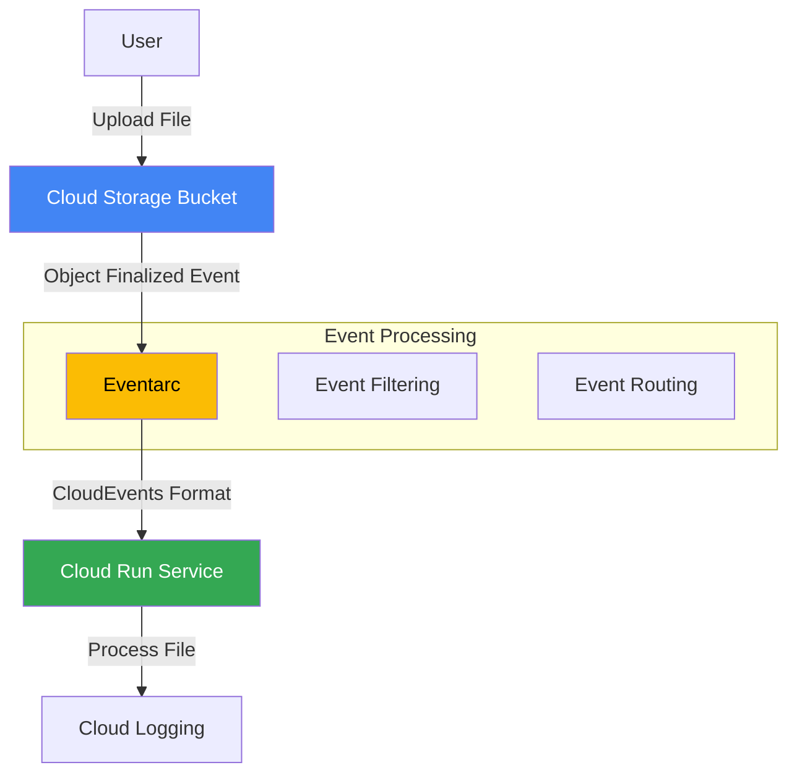
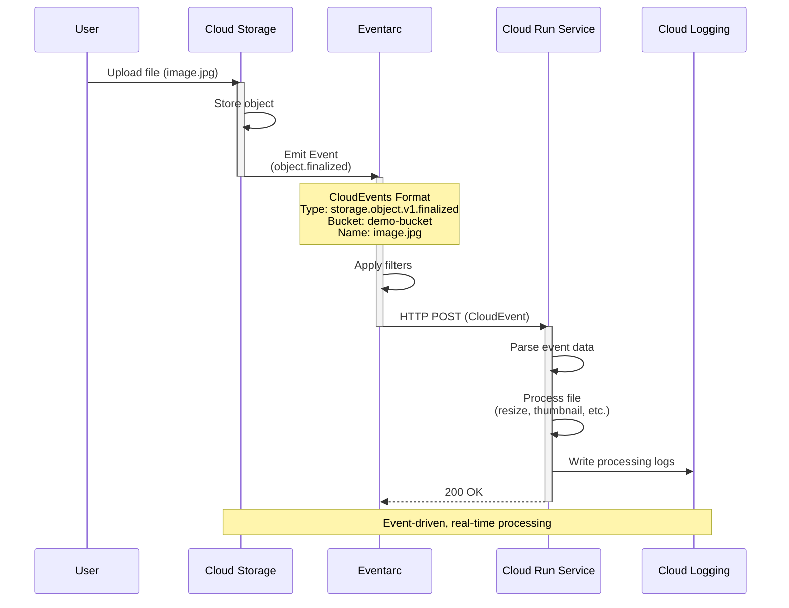

# Eventarc Demo

This demo shows how to use Eventarc to react to Cloud Storage events in real-time.

## What This Demo Does

Creates an event-driven system that:
1. Creates a Cloud Storage bucket
2. Deploys a Cloud Run service to process events
3. Sets up an Eventarc trigger for file uploads
4. Automatically processes files when they're uploaded to the bucket

## Architecture



**Event Flow:**



**Key Components:**
1. **Event Source**: Cloud Storage generates events on file operations
2. **Event Router**: Eventarc filters and routes events
3. **Event Consumer**: Cloud Run service processes events
4. **CloudEvents**: Standardized event format for interoperability

## Use Case Simulated

Automated file processing pipeline where:
- Files uploaded to Cloud Storage trigger processing automatically
- No polling or scheduled jobs needed
- Event-driven, real-time processing
- Scales automatically based on upload volume

## Files

- `setup.sh`: Creates the bucket, Cloud Run service, and Eventarc trigger
- `trigger.sh`: Uploads a sample file to test the event trigger
- `cleanup.sh`: Removes all created resources
- `service/`: Contains the Cloud Run service code

## Prerequisites

- GCP project with billing enabled
- Eventarc API enabled
- Cloud Run API enabled
- Cloud Storage API enabled
- `gcloud` CLI authenticated

## Running the Demo

### 1. Setup

```bash
chmod +x setup.sh trigger.sh cleanup.sh
./setup.sh
```

This will:
- Create a Cloud Storage bucket for uploads
- Deploy a Cloud Run service to handle events
- Create an Eventarc trigger for storage events
- Set up necessary IAM permissions

### 2. Test the Trigger

Upload a file to trigger the event:

```bash
./trigger.sh
```

This uploads a sample file and the Cloud Run service will automatically process it.

### 3. Monitor Event Processing

View Cloud Run service logs:

```bash
gcloud run services logs read eventarc-demo-service --region=us-central1 --limit=20
```

Or in Cloud Console:
```
https://console.cloud.google.com/run/detail/us-central1/eventarc-demo-service
```

### 4. Upload Your Own Files

Upload files directly to the bucket:

```bash
gsutil cp myfile.txt gs://YOUR_BUCKET_NAME/
```

Each upload will trigger the event processing automatically.

### 5. View Eventarc Triggers

List all triggers:

```bash
gcloud eventarc triggers list --location=us-central1
```

Describe the trigger:

```bash
gcloud eventarc triggers describe storage-event-trigger --location=us-central1
```

### 6. Cleanup

Remove all created resources:

```bash
./cleanup.sh
```

## Key Concepts Demonstrated

1. **Event-Driven Architecture**: React to events without polling
2. **CloudEvents Format**: Standardized event structure
3. **Event Filtering**: Filter events by type and attributes
4. **Automatic Scaling**: Cloud Run scales based on event volume
5. **Decoupling**: Event producers don't know about consumers

## Event Types Supported

This demo uses Cloud Storage events, but Eventarc supports **90+ event sources** across Google Cloud Platform.

### Complete List of Eventarc Event Sources

#### 1. Cloud Storage Events (Direct)
- `google.cloud.storage.object.v1.finalized` - Object uploaded/created
- `google.cloud.storage.object.v1.deleted` - Object deleted
- `google.cloud.storage.object.v1.archived` - Object archived
- `google.cloud.storage.object.v1.metadataUpdated` - Object metadata changed

#### 2. Pub/Sub Events
- `google.cloud.pubsub.topic.v1.messagePublished` - Message published to topic

#### 3. Cloud Build Events
- `google.cloud.cloudbuild.build.v1.statusChanged` - Build status changed

#### 4. Artifact Registry Events
- `google.cloud.artifactregistry.repository.v1.created`
- `google.cloud.artifactregistry.repository.v1.updated`
- `google.cloud.artifactregistry.repository.v1.deleted`

#### 5. BigQuery Events (via Audit Logs)
- Dataset created, updated, deleted
- Table created, updated, deleted
- Job completed, failed
- Data modified

#### 6. Cloud SQL Events (via Audit Logs)
- Instance created, updated, deleted
- Database created, deleted
- User created, deleted
- Backup created

#### 7. Firestore Events (via Audit Logs)
- Document created, updated, deleted
- Collection created, deleted

#### 8. Cloud Run Events (via Audit Logs)
- Service created, updated, deleted
- Revision created, deleted
- Service traffic updated

#### 9. Cloud Functions Events (via Audit Logs)
- Function created, updated, deleted
- Function invocation completed

#### 10. Compute Engine Events (via Audit Logs)
- Instance created, started, stopped, deleted
- Disk created, attached, detached, deleted
- Network created, updated, deleted
- Firewall rule created, updated, deleted

#### 11. Google Kubernetes Engine (GKE) Events (via Audit Logs)
- Cluster created, updated, deleted
- Node pool created, updated, deleted
- Workload deployed, updated, deleted

#### 12. Cloud Spanner Events (via Audit Logs)
- Instance created, updated, deleted
- Database created, deleted
- Admin operation completed

#### 13. Vertex AI Events (via Audit Logs)
- Model created, updated, deleted
- Endpoint created, updated, deleted
- Training job started, completed, failed

#### 14. Cloud Dataflow Events (via Audit Logs)
- Job created, started, completed, failed
- Pipeline created, updated, deleted

#### 15. Cloud Dataproc Events (via Audit Logs)
- Cluster created, started, stopped, deleted
- Job submitted, completed, failed

#### 16. Cloud Composer Events (via Audit Logs)
- Environment created, updated, deleted
- DAG run started, completed, failed

#### 17. Cloud IoT Core Events (via Audit Logs)
- Device created, updated, deleted
- Registry created, updated, deleted
- Message sent, received

#### 18. Secret Manager Events (via Audit Logs)
- Secret created, updated, deleted
- Secret version created, accessed, destroyed

#### 19. Cloud KMS Events (via Audit Logs)
- Key created, updated, deleted
- Encrypt/decrypt operation performed
- Key version created, destroyed

#### 20. Identity and Access Management (IAM) Events (via Audit Logs)
- Service account created, updated, deleted
- Role granted, revoked
- Policy updated

#### 21. Cloud Resource Manager Events (via Audit Logs)
- Project created, updated, deleted
- Folder created, updated, deleted
- Organization policy updated

#### 22. VPC Network Events (via Audit Logs)
- VPC created, updated, deleted
- Subnet created, updated, deleted
- Peering connection created, deleted
- VPN tunnel created, deleted

#### 23. Cloud Load Balancing Events (via Audit Logs)
- Load balancer created, updated, deleted
- Backend service created, updated, deleted
- SSL certificate created, updated, deleted

#### 24. Cloud DNS Events (via Audit Logs)
- Managed zone created, updated, deleted
- Record set created, updated, deleted

#### 25. Cloud CDN Events (via Audit Logs)
- CDN configuration updated
- Cache invalidation requested

#### 26. Cloud Armor Events (via Audit Logs)
- Security policy created, updated, deleted
- Rule created, updated, deleted

#### 27. Certificate Manager Events (via Audit Logs)
- Certificate created, updated, deleted
- Certificate map created, updated, deleted

#### 28. Cloud Deploy Events (via Audit Logs)
- Release created, approved, deployed
- Rollout created, succeeded, failed

#### 29. Binary Authorization Events (via Audit Logs)
- Policy created, updated, deleted
- Attestation created

#### 30. Cloud Source Repositories Events (via Audit Logs)
- Repository created, deleted
- Code pushed

#### 31. Cloud Logging Events (via Audit Logs)
- Log sink created, updated, deleted
- Log exclusion created, updated, deleted

#### 32. Cloud Monitoring Events (via Audit Logs)
- Alert policy created, updated, deleted
- Uptime check created, updated, deleted

#### 33. Cloud Trace Events (via Audit Logs)
- Trace recorded

#### 34. Cloud Profiler Events (via Audit Logs)
- Profile created

#### 35. Error Reporting Events (via Audit Logs)
- Error group created, updated

#### 36. Cloud Scheduler Events (via Audit Logs)
- Job created, updated, deleted, executed

#### 37. Cloud Tasks Events (via Audit Logs)
- Queue created, updated, deleted
- Task created, executed, deleted

#### 38. Workflows Events (via Audit Logs)
- Workflow created, updated, deleted
- Execution started, completed, failed

#### 39. Apigee Events (via Audit Logs)
- API proxy deployed
- Environment created, updated, deleted

#### 40. API Gateway Events (via Audit Logs)
- Gateway created, updated, deleted
- API config created, updated, deleted

#### 41. Cloud Memorystore Events (via Audit Logs)
- Redis instance created, updated, deleted
- Memcached instance created, updated, deleted

#### 42. Cloud Bigtable Events (via Audit Logs)
- Instance created, updated, deleted
- Table created, deleted
- Backup created, restored

#### 43. Cloud Filestore Events (via Audit Logs)
- Instance created, updated, deleted
- Backup created, deleted

#### 44. Cloud Run for Anthos Events (via Audit Logs)
- Service created, updated, deleted

#### 45. Anthos Config Management Events (via Audit Logs)
- Config sync status changed
- Policy violation detected

#### 46. Anthos Service Mesh Events (via Audit Logs)
- Mesh configuration updated

#### 47. Cloud Endpoints Events (via Audit Logs)
- Service config deployed
- API called

#### 48. Cloud Healthcare API Events (via Audit Logs)
- FHIR store created, updated, deleted
- HL7v2 store created, updated, deleted
- DICOM store created, updated, deleted

#### 49. Life Sciences API Events (via Audit Logs)
- Pipeline run started, completed, failed

#### 50. Datastream Events (via Audit Logs)
- Stream created, started, stopped, deleted
- Connection profile created, updated, deleted

#### 51. Dataplex Events (via Audit Logs)
- Lake created, updated, deleted
- Zone created, updated, deleted
- Asset created, updated, deleted

#### 52. Analytics Hub Events (via Audit Logs)
- Data exchange created, updated, deleted
- Listing created, updated, deleted

#### 53. Looker Events (via Audit Logs)
- Dashboard viewed
- Look executed

#### 54. Cloud Data Fusion Events (via Audit Logs)
- Instance created, updated, deleted
- Pipeline created, started, completed

#### 55. Cloud Pub/Sub Lite Events (via Audit Logs)
- Topic created, updated, deleted
- Subscription created, updated, deleted

#### 56. AlloyDB Events (via Audit Logs)
- Cluster created, updated, deleted
- Instance created, updated, deleted
- Backup created, deleted

#### 57. Database Migration Service Events (via Audit Logs)
- Migration job created, started, completed, failed
- Connection profile created, updated, deleted

#### 58. Dataproc Metastore Events (via Audit Logs)
- Service created, updated, deleted
- Backup created, restored, deleted

#### 59. Cloud Data Loss Prevention Events (via Audit Logs)
- Job created, started, completed, failed
- Inspection template created, updated, deleted

#### 60. reCAPTCHA Enterprise Events (via Audit Logs)
- Assessment created
- Key created, updated, deleted

### Event Filtering Capabilities

You can filter events by:
- **Event type**: Specific event names
- **Resource**: Specific buckets, projects, instances, etc.
- **Attributes**: Custom CloudEvents attributes
- **Path patterns**: File paths, resource names, etc.

### Example: Multiple Event Types

```bash
# Trigger on multiple Cloud Storage events
gcloud eventarc triggers create multi-storage-trigger \
  --destination-run-service=processor \
  --event-filters="type=google.cloud.storage.object.v1.finalized" \
  --event-filters="bucket=uploads" \
  --location=us-central1

# Trigger on Pub/Sub messages
gcloud eventarc triggers create pubsub-trigger \
  --destination-run-service=subscriber \
  --event-filters="type=google.cloud.pubsub.topic.v1.messagePublished" \
  --transport-topic=projects/PROJECT/topics/TOPIC \
  --location=us-central1

# Trigger on Cloud Build completion
gcloud eventarc triggers create build-trigger \
  --destination-run-service=notifier \
  --event-filters="type=google.cloud.cloudbuild.build.v1.statusChanged" \
  --location=us-central1
```

### Custom Events via Pub/Sub

You can also publish custom CloudEvents to Pub/Sub and route them via Eventarc:

```python
from cloudevents.http import CloudEvent
from google.cloud import pubsub_v1

publisher = pubsub_v1.PublisherClient()
topic_path = publisher.topic_path(project_id, topic_name)

event = CloudEvent({
    "type": "com.company.app.user.created",
    "source": "user-service",
    "data": {"user_id": "12345", "email": "user@example.com"}
})

publisher.publish(topic_path, event.data.encode())
```

### Audit Logs Events

For services not directly integrated, you can use **Cloud Audit Logs** to trigger on any GCP resource change:

```bash
gcloud eventarc triggers create audit-log-trigger \
  --destination-run-service=auditor \
  --event-filters="type=google.cloud.audit.log.v1.written" \
  --event-filters="serviceName=compute.googleapis.com" \
  --event-filters="methodName=v1.compute.instances.insert" \
  --location=us-central1
```

This allows you to react to virtually any operation in GCP!

## CloudEvents Structure

When a file is uploaded, Eventarc delivers an event like:

```json
{
  "specversion": "1.0",
  "type": "google.cloud.storage.object.v1.finalized",
  "source": "//storage.googleapis.com/buckets/BUCKET_NAME",
  "id": "unique-event-id",
  "time": "2024-01-01T12:00:00Z",
  "datacontenttype": "application/json",
  "data": {
    "bucket": "my-bucket",
    "name": "path/to/file.txt",
    "size": "1024",
    "contentType": "text/plain",
    "timeCreated": "2024-01-01T12:00:00Z"
  }
}
```

## Event Filtering

You can filter events to process only specific files:

```bash
# Only process .jpg files
--event-filters="bucket=my-bucket"
--event-filters-path-pattern="name=/images/*.jpg"

# Only process files in a specific folder
--event-filters-path-pattern="name=/uploads/*"
```

## Cost

- Eventarc: Event delivery charges apply (see pricing)
- Cloud Run: Pay only for request processing time
- Cloud Storage: Standard storage pricing
- This demo will cost very little for testing

## Common Use Cases

- **Image Processing**: Resize/optimize images on upload
- **Document Conversion**: Convert PDFs, generate thumbnails
- **Data Ingestion**: Process uploaded data files
- **Backup & Archival**: Archive files to cold storage
- **Metadata Extraction**: Extract and index file metadata
- **Virus Scanning**: Scan uploaded files for malware

## Troubleshooting

**Events not triggering?**
- Check service account permissions
- Verify trigger is active: `gcloud eventarc triggers describe storage-event-trigger --location=us-central1`
- Check Cloud Run logs for errors

**Service failing?**
- View logs: `gcloud run services logs read eventarc-demo-service --region=us-central1`
- Verify service is deployed: `gcloud run services describe eventarc-demo-service --region=us-central1`

**Permission errors?**
- Ensure Eventarc service account has proper permissions
- Check: `gcloud projects get-iam-policy PROJECT_ID`

## Advanced: Multiple Triggers

You can create multiple triggers on the same bucket:

```bash
# Trigger 1: Process images
gcloud eventarc triggers create image-processor \
  --destination-run-service=image-service \
  --event-filters="type=google.cloud.storage.object.v1.finalized" \
  --event-filters="bucket=my-bucket" \
  --event-filters-path-pattern="name=*.jpg"

# Trigger 2: Process videos
gcloud eventarc triggers create video-processor \
  --destination-run-service=video-service \
  --event-filters="type=google.cloud.storage.object.v1.finalized" \
  --event-filters="bucket=my-bucket" \
  --event-filters-path-pattern="name=*.mp4"
