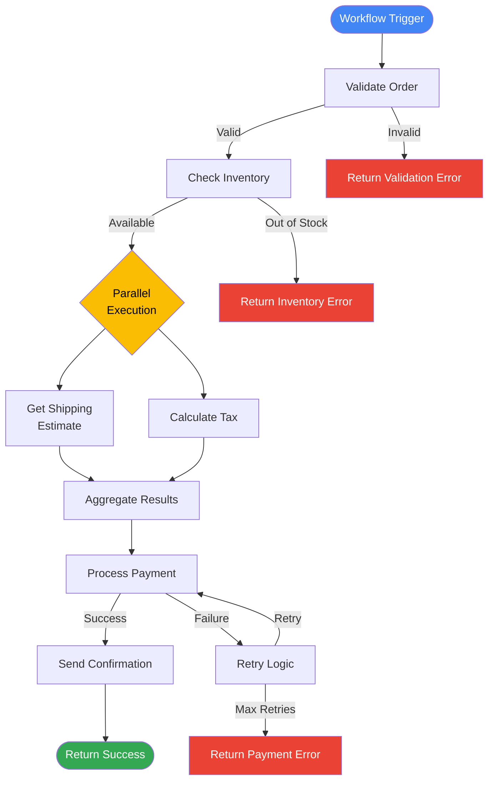
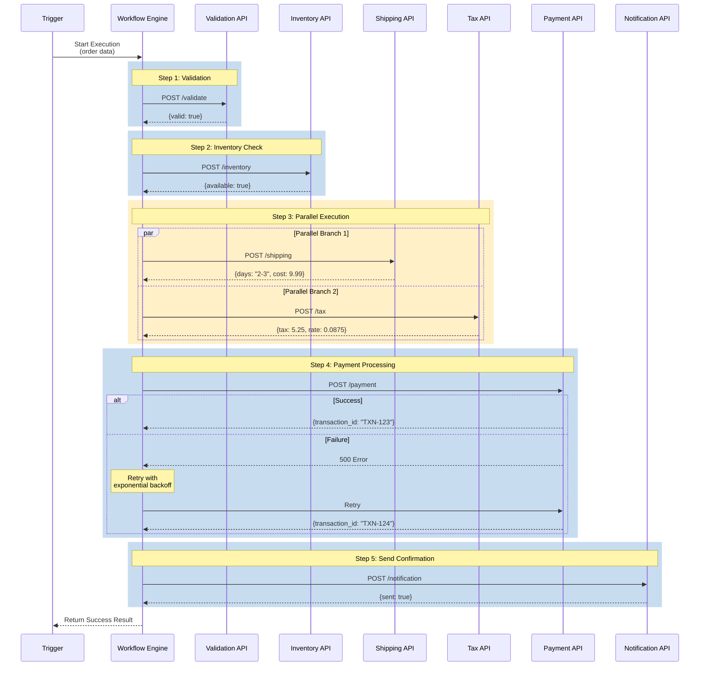

# Workflows Demo

This demo shows how to use Cloud Workflows to orchestrate multi-step processes with conditional logic, error handling, and parallel execution.

## What This Demo Does

Creates a workflow that demonstrates:
1. Multi-step order processing pipeline
2. Conditional logic and decision making
3. Error handling with retries
4. Parallel execution of independent steps
5. HTTP API calls to external services

## Architecture



**Detailed Workflow Execution:**



**Key Features Demonstrated:**
1. **Sequential Steps**: Validation → Inventory → Payment → Notification
2. **Conditional Logic**: Check validation and inventory before proceeding
3. **Parallel Execution**: Shipping and Tax APIs called simultaneously
4. **Error Handling**: Try-catch with retry logic for payment
5. **State Management**: Workflow maintains variables across all steps

## Use Case Simulated

E-commerce order processing workflow:
- Validate order data
- Check inventory availability
- Call multiple services in parallel (shipping estimate, tax calculation)
- Process payment
- Send confirmation email
- Handle errors at each step with retries

## Files

- `setup.sh`: Deploys the workflow and creates test endpoints
- `trigger.sh`: Executes the workflow with sample data
- `cleanup.sh`: Removes all created resources
- `workflow.yaml`: The workflow definition
- `mock-api/`: Mock HTTP endpoints for testing

## Prerequisites

- GCP project with billing enabled
- Workflows API enabled
- Cloud Functions API enabled (for mock endpoints)
- `gcloud` CLI authenticated

## Running the Demo

### 1. Setup

```bash
chmod +x setup.sh trigger.sh cleanup.sh
./setup.sh
```

This will:
- Deploy mock API endpoints (Cloud Functions)
- Create and deploy the workflow
- Set up necessary IAM permissions

### 2. Execute the Workflow

Run the workflow with sample order data:

```bash
./trigger.sh
```

This executes the workflow and shows the step-by-step execution.

### 3. Monitor Execution

View workflow executions:

```bash
gcloud workflows executions list order-processing-workflow --location=us-central1
```

Describe a specific execution:

```bash
gcloud workflows executions describe EXECUTION_ID \
  --workflow=order-processing-workflow \
  --location=us-central1
```

View execution in Cloud Console:
```
https://console.cloud.google.com/workflows
```

### 4. Test Error Handling

Trigger a workflow with invalid data to see error handling:

```bash
./trigger.sh --fail
```

This will demonstrate retry logic and error handling.

### 5. Cleanup

Remove all created resources:

```bash
./cleanup.sh
```

## Key Concepts Demonstrated

1. **Sequential Steps**: Execute steps in order
2. **Conditional Logic**: Make decisions based on data
3. **Parallel Execution**: Run independent steps simultaneously
4. **Error Handling**: Try-catch blocks with retries
5. **HTTP Calls**: Call external APIs and services
6. **Variable Management**: Pass data between steps
7. **Retry Policies**: Automatic retries with backoff

## Workflow Steps Explained

### Step 1: Validate Order
```yaml
- validate_order:
    call: http.post
    args:
      url: ${validate_api_url}
      body: ${order}
    result: validation_result
```
Calls validation API to check order data.

### Step 2: Conditional Check
```yaml
- check_validation:
    switch:
      - condition: ${validation_result.body.valid == true}
        next: check_inventory
      - condition: true
        next: return_error
```
Proceeds only if validation passes.

### Step 3: Parallel Execution
```yaml
- parallel_calls:
    parallel:
      branches:
        - call_shipping_api:
            call: http.post
        - call_tax_api:
            call: http.post
```
Calls multiple APIs simultaneously for efficiency.

### Step 4: Error Handling
```yaml
- process_payment:
    try:
      call: http.post
      args:
        url: ${payment_api_url}
    retry:
      max_retries: 3
      backoff:
        initial_delay: 1
        max_delay: 60
    except:
      as: e
      steps:
        - log_error:
            call: sys.log
```
Retries failed payments with exponential backoff.

## Workflow Variables

The workflow uses variables to pass data between steps:

```yaml
variables:
  order: ${input.order}
  validation_result: null
  inventory_check: null
  shipping_estimate: null
  payment_result: null
```

## Sample Input

```json
{
  "order": {
    "order_id": "ORD-12345",
    "customer_id": "CUST-789",
    "items": [
      {
        "product_id": "PROD-001",
        "quantity": 2,
        "price": 29.99
      }
    ],
    "total": 59.98,
    "shipping_address": {
      "street": "123 Main St",
      "city": "San Francisco",
      "state": "CA",
      "zip": "94102"
    }
  }
}
```

## Sample Output

```json
{
  "status": "success",
  "order_id": "ORD-12345",
  "validation": "passed",
  "inventory": "available",
  "shipping_estimate": "2-3 days",
  "tax": 5.25,
  "payment": "processed",
  "confirmation_sent": true
}
```

## Cost

- Workflows: First 5,000 steps free per month, then $0.01 per 1,000 steps
- Cloud Functions: Free tier includes 2M invocations/month
- This demo will cost virtually nothing for testing

## Common Use Cases

### 1. ETL Pipelines
```
Extract → Transform → Load → Validate → Notify
```

### 2. Approval Workflows
```
Submit → Review → Approve/Reject → Notify → Archive
```

### 3. Data Processing
```
Ingest → Validate → Transform → Enrich → Store → Index
```

### 4. Multi-Service Orchestration
```
Service A → Service B → Service C (all with retries)
```

### 5. Human-in-the-Loop
```
Automated Steps → Wait for Approval → Continue Processing
```

## Advanced Features

### Subworkflows
Break complex workflows into reusable subworkflows:

```yaml
- call_subworkflow:
    call: my_subworkflow
    args:
      data: ${input}
```

### Iterations (Loops)
Process arrays of items:

```yaml
- process_items:
    for:
      value: item
      in: ${order.items}
      steps:
        - process_item:
            call: http.post
```

### Wait/Sleep
Add delays between steps:

```yaml
- wait_for_processing:
    call: sys.sleep
    args:
      seconds: 30
```

## Troubleshooting

**Workflow execution failed?**
- Check logs: `gcloud workflows executions describe EXECUTION_ID --workflow=order-processing-workflow --location=us-central1`
- Verify endpoints are accessible
- Check IAM permissions

**Steps timing out?**
- Increase timeout in workflow definition
- Check if external APIs are responding
- Review retry configuration

**Variables not passing correctly?**
- Use `sys.log` to debug variable values
- Verify JSON structure matches expected format

## Integration Examples

### Trigger from Cloud Scheduler
```bash
gcloud scheduler jobs create http workflow-job \
  --schedule="0 9 * * *" \
  --uri="https://workflowexecutions.googleapis.com/v1/projects/PROJECT/locations/REGION/workflows/WORKFLOW/executions" \
  --message-body='{"argument": "{\"order_id\": \"12345\"}"}'
```

### Trigger from Eventarc
```bash
gcloud eventarc triggers create storage-to-workflow \
  --destination-workflow=order-processing-workflow \
  --event-filters="type=google.cloud.storage.object.v1.finalized"
```

### Trigger from Cloud Tasks
Create a task that invokes workflow execution endpoint.

## Workflow Best Practices

1. **Keep steps focused**: Each step should do one thing
2. **Use retries**: Add retry policies to handle transient failures
3. **Log important steps**: Use `sys.log` for debugging
4. **Handle errors**: Use try-catch blocks
5. **Use variables**: Pass data between steps efficiently
6. **Timeout appropriately**: Set realistic timeouts
7. **Use subworkflows**: Break complex workflows into manageable pieces
